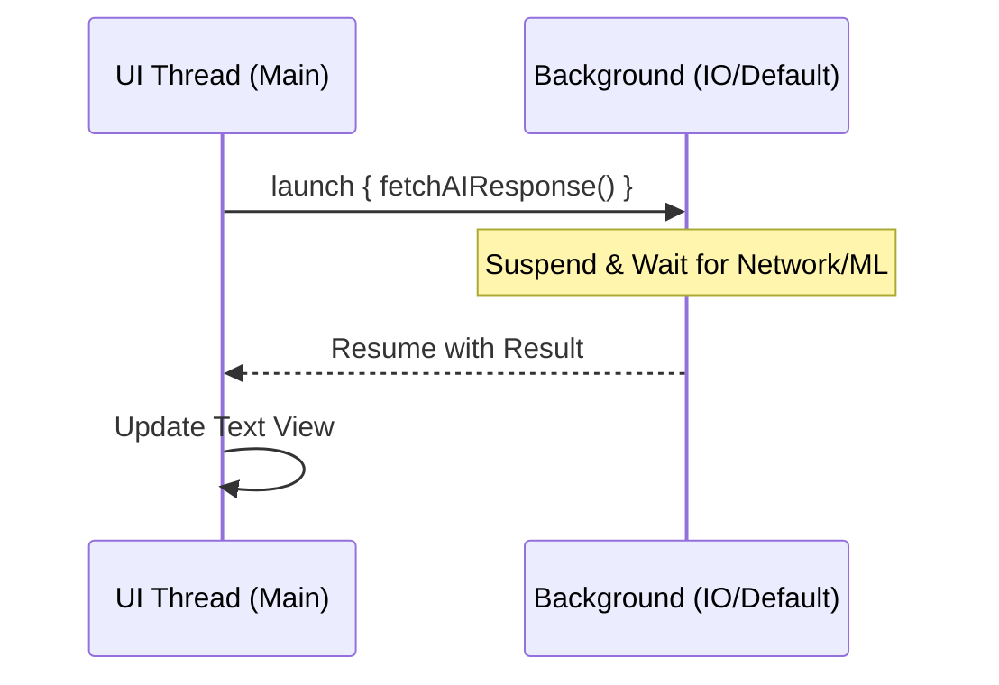

# Week 1: Kotlin Deep Dive for Android & AI Applications

**Goal:** Transition from basic syntax to professional-grade Kotlin features, focusing on safety, concurrency, and patterns used in AI-integrated mobile apps.

---

## 0. Lecture Agenda
*   The Modern Kotlin Philosophy (Why Kotlin for AI?)
*   The Advanced Type System (Sealed Classes & Data Handling)
*   Mastering Scope Functions & Functional Paradigms
*   Structured Concurrency (Coroutines & Introduction to Flow)
*   Live Demo: Building a Reactive AI Data Layer
*   Summary & Lab Briefing

---

## 1. The Modern Kotlin Philosophy
Kotlin is designed for **readability** and **safety**. In AI development, where data can be unpredictable (streaming from LLMs), these features are critical.

| Concept | Java Approach | Kotlin Approach | AI Relevance |
| :--- | :--- | :--- | :--- |
| **Conciseness** | Verbose boilerplate | Concise expression | Faster iteration on AI prompts. |
| **Null Safety** | Runtime Checks | Compile-time checks | Preventing crashes from empty AI responses. |
| **Concurrency** | Threads/Callbacks | Coroutines/Flow | Handling non-blocking AI inference. |

---

## 2. Advanced Type System: Modeling AI Logic

### Sealed Classes: The State Machine
Sealed classes are the "gold standard" for managing UI and AI states in Android.

```kotlin
// Perfect for handling an AI Request Lifecycle
sealed class AIState {
    object Idle : AIState()
    object Thinking : AIState()
    data class ResponseReceived(val content: String) : AIState()
    data class Error(val exception: Throwable) : AIState()
}
```

### Delegate Properties: `lateinit` vs `lazy`
| Feature | `lateinit var` | `val ... by lazy` |
| :--- | :--- | :--- |
| **Mutation** | Mutable (var) | Read-only (val) |
| **Initialization** | Manual, anytime | Automatic on first access |
| **Use Case** | Dependency Injection | Expensive objects (AI Models/Database) |

---

## 3. Scope Functions & Functional Processing

### Scope Functions: `let`, `run`, `with`, `apply`, `also`
These reduce temporary variable clutter.

```kotlin
// Example: Validating and Processing User Prompt
val userPrompt: String? = "  summarize this article  "

val processedPrompt = userPrompt?.let {
    it.trim().lowercase()
} ?: "Default prompt"

val aiClient = GeminiClient().apply {
    apiKey = "..."
    temperature = 0.9f
}
```

### Functional Collections
Processing AI data streams often requires filtering and mapping.
```kotlin
val rawLogs = listOf("Error: 404", "AI: Hello", "User: Hey", "AI: How can I help?")
val aiResponses = rawLogs
    .filter { it.startsWith("AI:") }
    .map { it.removePrefix("AI: ") }
```

---

## 4. Structured Concurrency

### Coroutines: The Non-Blocking Engine
AI inference is heavy. We *must* use `Dispatchers.Default` or `IO`.



### Introduction to Kotlin Flow (Streaming AI Results)
For AI models that support "streaming" (word by word), `Flow` is essential.

```kotlin
fun streamAIResponse(): Flow<String> = flow {
    val words = listOf("Thinking...", "The", "capital", "of", "France", "is", "Paris.")
    for (word in words) {
        delay(500) // Simulate streaming delay
        emit(word)
    }
}

// In Activity/ViewModel
lifecycleScope.launch {
    streamAIResponse().collect { word ->
        print("$word ")
    }
}
```

---

## 5. Live Demo: Building a Reactive AI Data Layer
*Instructor Demo:*
1.  Define an `AIViewModel` using a `StateFlow`.
2.  Implement a `suspend` function that uses `withContext(Dispatchers.IO)`.
3.  Show how `apply` simplifies model configuration.

---

## 6. Summary & Lab Briefing
*   **Key Takeaway:** Use Sealed Classes for state, Coroutines for off-main-thread work, and Flow for streaming.
*   **Lab:** Build a "Mock AI Chat" console app using the concepts above.

---

## Related Resources
*   [Kotlin Flow Guide](https://kotlinlang.org/docs/flow.html)
*   [Coroutines on Android (Official Docs)](https://developer.android.com/kotlin/coroutines)
*   [Advanced Kotlin Tips](https://kotlinlang.org/docs/coding-conventions.html)

---

## Interactive Discussion Points
1.  Why is `var` generally discouraged in modern Kotlin compared to `val`?
2.  When would you use `Dispatchers.Default` instead of `Dispatchers.IO` for an AI task?
3.  How does `sealed class` help avoid `else` branches in `when` expressions?
