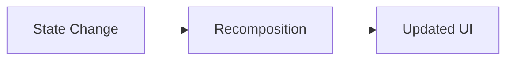

# Week 2: Android Basics & UI with Jetpack Compose

**Goal:** Understand the Android project ecosystem and master the fundamentals of declarative UI design using Jetpack Compose, the modern toolkit for building native Android interfaces.

---

## 0. Lecture Agenda
*   Android Studio & Project Anatomy
*   Declarative vs. Imperative UI Paradigms
*   Jetpack Compose Fundamentals (Composables & Modifiers)
*   **Comprehensive Layouts (Standard, Structural, and List Layouts)**
*   Live Demo: Building an AI Chat Interface Skeleton
*   Summary & Lab Briefing

---

## 1. Android Studio & Project Anatomy
Navigating a modern Android project. Understanding where the code, resources, and build logic reside.

| Component | Description | AI Productivity Tip |
| :--- | :--- | :--- |
| **`app/src/main/java`** | Your Kotlin source code (Activities, ViewModels). | Use Gemini to refactor logic or generate unit tests. |
| **`app/src/main/res`** | Static resources (Icons, XML, Strings). | Use AI to generate Vector Drawables or localized strings. |
| **`build.gradle.kts`** | Project and module dependencies. | Ask AI to resolve version conflicts or add new libraries. |
| **`AndroidManifest.xml`** | App identity, permissions, and components. | |

---

## 2. The Paradigm Shift: Declarative UI
Jetpack Compose is **declarative**, meaning you describe *what* the UI should look like for a given state, rather than *how* to change it (Imperative).



### Why Compose for AI Apps?
*   **Rapid Prototyping:** Build complex AI interfaces with much less code.
*   **Dynamic Layouts:** Easily handle varying lengths of AI-generated text.
*   **State-Driven:** UI updates automatically as the AI model streams responses.

---

## 3. Jetpack Compose Fundamentals

### The `@Composable` Function
Composables are the building blocks. They are functions, not objects.

```kotlin
@Composable
fun Greeting(name: String) {
    Text(text = "Hello, $name!")
}
```

### Modifiers: The "Swiss Army Knife"
Modifiers allow you to decorate or augment a composable (size, padding, behavior).

```kotlin
@Composable
fun MessageCard(text: String) {
    Text(
        text = text,
        modifier = Modifier
            .padding(16.dp)
            .fillMaxWidth()
            .background(Color.LightGray)
            .clickable { /* Handle click */ }
    )
}
```

---

## 4. Master All Major Layouts
Compose provides layouts for every use case, from basic positioning to complex structural hierarchies.

### The Layout Matrix
| Category | Layout | Direction / Behavior | Use Case |
| :--- | :--- | :--- | :--- |
| **Basic** | `Column` | Vertical | Vertical stack of elements. |
| **Basic** | `Row` | Horizontal | Horizontal alignment (e.g., Icon + Text). |
| **Basic** | `Box` | Z-axis (Stack) | Overlaying elements (e.g., Badge on Image). |
| **Utility** | `Spacer` | Empty space | Flexible or fixed gaps between elements. |
| **Structural**| `Scaffold` | Slot-based | Top bars, Bottom bars, and SnackBar support. |
| **Lists** | `LazyColumn`| Vertical Scrolling | **Efficient** lists of messages (recycles UI). |
| **Lists** | `LazyRow` | Horizontal Scrolling| Image carousels or tag chips. |

### Structural Layout: `Scaffold`
The `Scaffold` provides "slots" for standard Material Design components.

```kotlin
@Composable
fun MainAppScreen() {
    Scaffold(
        topBar = { TopAppBar(title = { Text("AI Assistant") }) },
        floatingActionButton = { FloatingActionButton(onClick = {}) { /* + */ } }
    ) { paddingValues ->
        // Content goes here, respecting the padding
        ChatScreen(modifier = Modifier.padding(paddingValues))
    }
}
```

### Efficient Lists: `LazyColumn`
Unlike a standard `Column`, `LazyColumn` only renders items visible on screen—essential for long chat histories.

```kotlin
@Composable
fun MessageList(messages: List<String>) {
    LazyColumn {
        items(messages) { message ->
            ChatBubble(message = message)
        }
    }
}
```

---

## 5. Live Demo: Building an AI Chat Interface Skeleton
*Instructor Demo:*
1.  Initialize a `Scaffold` with a `TopAppBar`.
2.  Implement a `LazyColumn` for the message history.
3.  Add a sticky `Row` at the bottom for the input field and send button.
4.  Show how `Spacer(Modifier.weight(1f))` pushes elements apart.

---

## 6. Summary & Lab Briefing
*   **Key Takeaway:** Choose the right layout for the job: `Scaffold` for structure, `LazyColumn` for data, and `Row/Column` for details.
*   **Lab:** Create a "Chat Dashboard" using a `Scaffold`. It should have a `LazyRow` of active contacts at the top and a `LazyColumn` of recent messages below.

---

## Related Resources
*   **[Jetpack Compose Layouts Guide](https://developer.android.com/jetpack/compose/layouts)**
*   **[Lists and Grids in Compose](https://developer.android.com/jetpack/compose/lists)**
*   **[Material Design Scaffold](https://developer.android.com/jetpack/compose/components/scaffold)**

---

## Interactive Discussion Points
1.  Why is `LazyColumn` better than a `Column` with a `verticalScroll` modifier for 1000 items?
2.  How does `Scaffold` simplify the creation of Material Design compliant apps?
3.  When would you use a `Box` instead of a `Row`?
